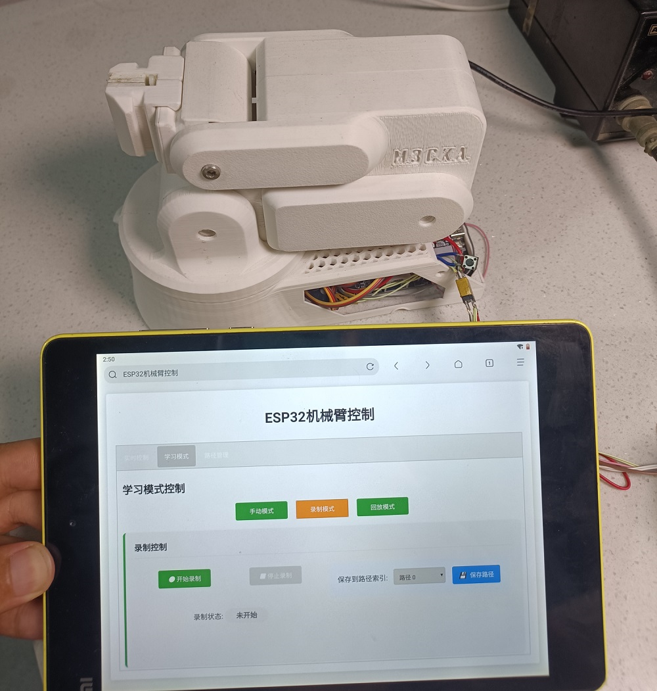
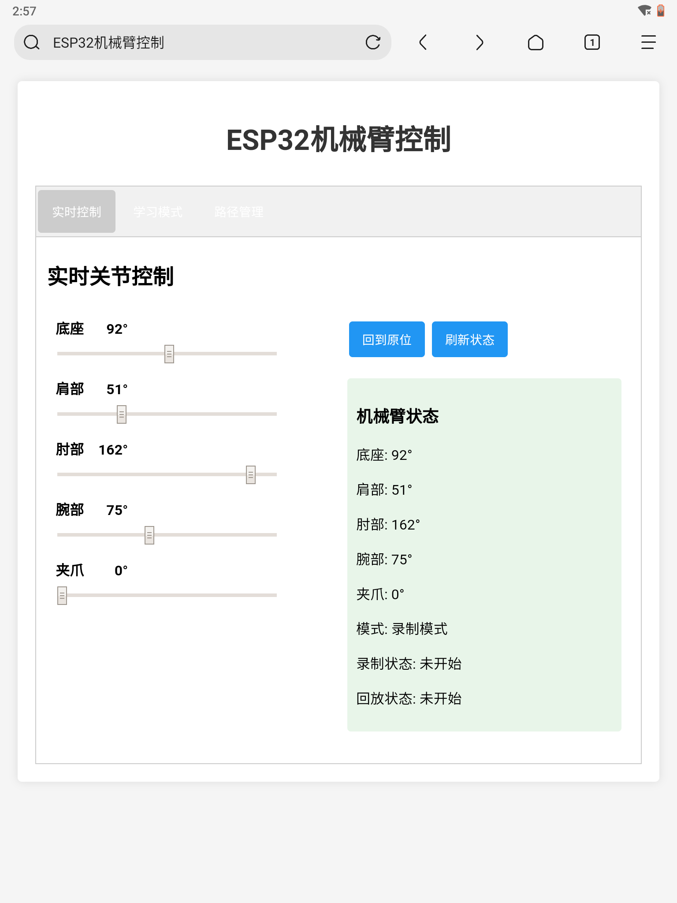
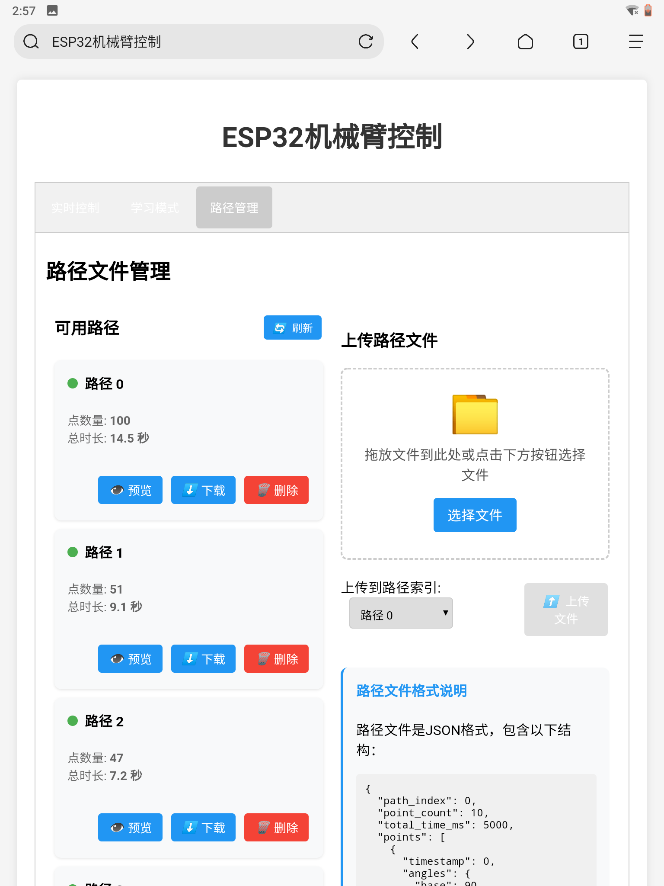
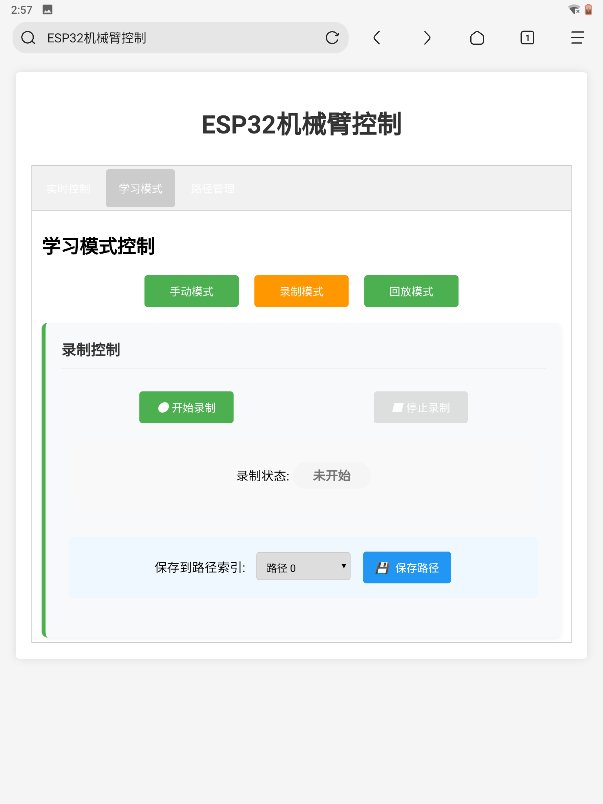

# ESP32 5自由度机械臂控制系统

[](https://docs.espressif.com/projects/esp-idf/en/latest/esp32/index.html)
[](LICENSE)
[](https://www.espressif.com/en/products/socs/esp32)

<p align="center">
  
</p>

> 基于ESP32-WROOM和PCA9685的5自由度机械臂控制系统，使用ESP-IDF框架开发。机械臂结构使用了开源项目(https://www.youtube.com/watch?v=5toNqaGsGYs)，系统支持Web界面控制、学习模式和路径管理功能。

## 📋 目录

- [功能特点](#-功能特点)
- [硬件要求](#-硬件要求)
- [硬件连接](#-硬件连接)
- [Web界面功能](#-web界面功能)
- [WiFi连接](#-wifi连接)
- [快速开始](#-快速开始)
- [系统组件](#-系统组件)
- [代码架构](#-代码架构)
- [使用指南](#-使用指南)
- [自定义配置](#-自定义配置)
- [故障排除](#-故障排除)
- [贡献指南](#-贡献指南)
- [许可证](#-许可证)
- [致谢](#-致谢)

## 🚀 功能特点

- **高性能控制**：基于ESP32-WROOM和ESP-IDF框架开发
- **精准运动**：舵机平滑移动和速度控制
- **多种控制模式**：
  - 关节角度控制
  - 末端位置控制（正/逆运动学）
  - 夹爪精确控制
- **Web界面控制**：通过WiFi连接，在浏览器中实时控制机械臂
- **学习模式**：记录和回放机械臂运动路径
- **路径管理**：保存、加载、下载和上传路径文件
- **无线操作**：支持AP模式和STA模式连接
- **高可靠性**：完善的错误处理和状态反馈机制

## 🔧 硬件要求

- ESP32-WROOM开发板
- PCA9685 16通道PWM控制器
- 5个舵机（推荐使用SG90或MG996R等）
- 5V/3A以上电源（舵机供电）
- 连接线
- (可选) 电位器用于手动控制模式

### 推荐配置

| 组件 | 型号 | 数量 |
|------|------|------|
| 主控板 | ESP32-WROOM-32 | 1 |
| PWM控制器 | PCA9685 | 1 |
| 底座舵机 | MG996R | 1 |
| 关节舵机 | MG996R | 3 |
| 夹爪舵机 | SG90 | 1 |
| 电源 | 5V/2A电源适配器 | 1 |
| 电位器 | 10K欧姆 | 5 |

## 📐 硬件连接

### ESP32到PCA9685的连接：

| ESP32    | PCA9685 |
|----------|---------|
| GPIO 21  | SDA     |
| GPIO 22  | SCL     |
| 3.3V     | VCC     |
| GND      | GND     |

### PCA9685到舵机的连接：

| PCA9685通道 | 舵机        |
|-------------|------------|
| 通道0       | 底座舵机    |
| 通道1       | 肩部舵机    |
| 通道2       | 肘部舵机    |
| 通道3       | 腕部舵机    |
| 通道4       | 夹爪舵机    |

### 电位器连接（可选）：

| ESP32 ADC引脚 | 电位器 |
|--------------|-------|
| GPIO 36      | 底座电位器 |
| GPIO 39      | 肩部电位器 |
| GPIO 34      | 肘部电位器 |
| GPIO 35      | 腕部电位器 |
| GPIO 32      | 夹爪电位器 |

**⚠️ 注意：** 
- 舵机的供电应该直接连接到PCA9685的V+和GND，使用单独的5V电源（不要使用ESP32的5V引脚）。
- 确保电源能够提供足够的电流，尤其是在多个舵机同时运动时。

## 🖥️ Web界面功能

系统提供了一个完整的Web界面，可通过浏览器访问控制机械臂：

<p align="center">
  
  
  
</p>

### 实时控制

- 使用滑块直接控制每个关节的角度
- 实时反馈当前机械臂状态
- 一键回到原位功能

### 学习模式

- **手动模式**：使用Web界面或电位器控制机械臂
- **录制模式**：记录机械臂的运动路径
  - 自定义采样率
  - 实时状态显示
- **回放模式**：回放已保存的路径
  - 可调整回放速度
  - 循环回放选项

### 路径管理

- **保存路径**：将记录的路径保存到ESP32的NVS存储
- **加载路径**：从NVS加载保存的路径
- **下载路径**：将路径导出为JSON文件
- **上传路径**：从JSON文件导入路径
- **路径预览**：查看路径点数据

## 📡 WiFi连接

系统支持两种WiFi连接模式：

1. **AP模式**：ESP32创建自己的WiFi网络
   - 默认SSID：`ESP32_RoboticArm`
   - 默认密码：`12345678`
   - 默认IP地址：`192.168.4.1`

2. **STA模式**：ESP32连接到现有WiFi网络
   - 可通过修改源代码配置WiFi凭据
   - IP地址由路由器DHCP分配

连接后，可以通过浏览器访问ESP32的IP地址来控制机械臂。

## 🏁 快速开始

### 环境准备

1. 安装ESP-IDF环境（[官方安装指南](https://docs.espressif.com/projects/esp-idf/en/latest/esp32/get-started/index.html)）
2. 克隆本仓库：
```bash
git clone https://github.com/yourusername/ESP32_Robotic_Arm.git
cd ESP32_Robotic_Arm
```

### 编译和烧录

1. 配置项目（根据需要调整）：
```bash
idf.py menuconfig
```

2. 编译项目：
```bash
idf.py build
```

3. 烧录到ESP32：
```bash
idf.py -p [COM端口] flash
```

4. 监视串口输出：
```bash
idf.py -p [COM端口] monitor
```

### 首次使用

1. 上电后，ESP32将创建一个WiFi热点（AP模式）或连接到配置的WiFi网络（STA模式）
2. 连接到ESP32的WiFi网络或查看串口输出获取IP地址
3. 使用浏览器访问ESP32的IP地址
4. 开始使用Web界面控制机械臂

## 🧩 系统组件

本项目由以下主要组件组成：

1. **pca9685**：PCA9685 PWM控制器驱动
   - 提供16通道PWM输出
   - 支持精确的脉冲宽度控制

2. **servo_controller**：舵机控制抽象层
   - 角度到脉冲宽度的映射
   - 平滑移动和速度控制

3. **robotic_arm**：机械臂控制和运动学计算
   - 正向和逆向运动学
   - 坐标系转换
   - 路径规划

4. **learning_controller**：学习模式和路径管理功能
   - 路径记录和回放
   - NVS存储管理

5. **web_controller**：Web服务器和界面控制
   - HTTP服务器
   - WebSocket实时通信
   - 响应式Web界面

## 📂 代码架构

```
ESP32_WROOM_IDF_Rebot_wifi/
├── components/
│   ├── pca9685/                  # PCA9685 PWM控制器驱动
│   │   ├── include/
│   │   └── pca9685.c
│   ├── servo_controller/         # 舵机控制抽象层
│   │   ├── include/
│   │   └── servo_controller.c
│   ├── robotic_arm/             # 机械臂控制和运动学计算
│   │   ├── include/
│   │   └── robotic_arm.c
│   ├── learning_controller/     # 学习模式和路径管理
│   │   ├── include/
│   │   └── learning_controller.c
│   └── web_controller/         # Web服务器和界面
│       ├── include/
│       ├── web_controller.c
│       ├── wifi_handlers.c
│       └── www/                # Web界面文件
│           └── index.html      # 主界面
├── main/
│   ├── main.c                  # 主程序
│   └── CMakeLists.txt
├── partitions.csv              # 分区表
├── CMakeLists.txt
├── sdkconfig                   # SDK配置
└── README.md                   # 项目文档
```

## 📖 使用指南

### 学习模式使用指南

#### 录制路径

1. 在Web界面中，切换到"学习模式"标签
2. 选择"录制模式"
3. 点击"开始录制"按钮
4. 使用Web界面或电位器控制机械臂移动
5. 完成后点击"停止录制"
6. 选择一个路径索引（0-4）并点击"保存路径"

#### 回放路径

1. 在Web界面中，切换到"学习模式"标签
2. 选择"回放模式"
3. 选择要回放的路径索引
4. 点击"加载路径"按钮
5. 点击"开始回放"按钮
6. 完成后点击"停止回放"或等待自动完成

### 路径管理使用指南

#### 下载路径文件

1. 在Web界面中，切换到"路径管理"标签
2. 在路径列表中找到要下载的路径
3. 点击"下载"按钮，浏览器将下载JSON格式的路径文件

#### 上传路径文件

1. 在Web界面中，切换到"路径管理"标签
2. 点击"选择文件"按钮或将文件拖放到上传区域
3. 选择要上传到的路径索引
4. 点击"上传文件"按钮

### 路径文件格式

路径文件使用JSON格式，结构如下：

```json
{
  "path_index": 0,
  "point_count": 10,
  "total_time_ms": 5000,
  "points": [
    {
      "timestamp": 0,
      "angles": {
        "base": 90,
        "shoulder": 90,
        "elbow": 90,
        "wrist": 90,
        "gripper": 45
      }
    },
    // 更多点...
  ]
}
```

## ⚙️ 自定义配置

### WiFi设置

在`main/main.c`中修改以下定义：

```c
// WiFi凭据 - STA模式
#define ESP32_WIFI_SSID      "your_wifi_ssid"
#define ESP32_WIFI_PASSWORD  "your_wifi_password"

// AP模式设置
#define ESP32_AP_SSID        "ESP32_RoboticArm"
#define ESP32_AP_PASSWORD    "12345678"
```

### 舵机参数

在`main/main.c`中修改舵机参数：

```c
// 舵机参数定义
#define BASE_SERVO_CHANNEL     0
#define SHOULDER_SERVO_CHANNEL 1
#define ELBOW_SERVO_CHANNEL    2
#define WRIST_SERVO_CHANNEL    3
#define GRIPPER_SERVO_CHANNEL  4

// 舵机角度限制
#define BASE_MIN_ANGLE     0
#define BASE_MAX_ANGLE     180
#define SHOULDER_MIN_ANGLE 0
#define SHOULDER_MAX_ANGLE 180
// ... 更多参数 ...
```

### 机械臂尺寸

调整机械臂连杆长度：

```c
// 机械臂连杆长度 (单位：毫米)
#define ARM_LENGTH      105.0f  // 上臂长度
#define FOREARM_LENGTH  100.0f  // 前臂长度
#define WRIST_LENGTH    50.0f   // 腕部长度
#define BASE_HEIGHT     85.0f   // 基座高度
```

## ❓ 故障排除

### 常见问题

1. **无法连接到ESP32的WiFi**
   - 检查ESP32是否已上电
   - 确认WiFi名称和密码正确
   - 尝试重启ESP32

2. **Web界面无法加载**
   - 确认浏览器地址栏中的IP地址正确
   - 检查ESP32是否已连接到网络
   - 查看串口输出获取正确的IP地址

3. **舵机不移动或抖动**
   - 检查舵机连接是否正确
   - 确认电源能够提供足够的电流
   - 检查PWM信号是否正常

4. **路径保存失败**
   - 确保路径中包含至少一个点
   - 检查NVS存储是否已满
   - 尝试先删除现有路径

5. **上传路径文件失败**
   - 确认文件格式正确
   - 检查文件大小是否超过限制
   - 查看ESP32串口日志获取详细错误信息

### 调试技巧

- 使用串口监视器查看详细日志
- 启用ESP-IDF的组件级日志：
  ```
  idf.py menuconfig
  # 导航到 Component config -> Log output -> Default log verbosity
  ```
- 检查Web浏览器的开发者工具中的控制台输出

## 👥 贡献指南

欢迎贡献代码、报告问题或提出新功能建议！

1. Fork本仓库
2. 创建功能分支：`git checkout -b feature/amazing-feature`
3. 提交更改：`git commit -m 'Add some amazing feature'`
4. 推送到分支：`git push origin feature/amazing-feature`
5. 提交Pull Request

### 代码规范

- 遵循ESP-IDF编码规范
- 添加适当的注释和文档
- 确保代码通过编译且功能正常

## 📄 许可证

本项目采用MIT许可证 - 详情请参阅[LICENSE](LICENSE)文件

## 🙏 致谢

- [Espressif Systems](https://www.espressif.com/)提供的ESP32平台和ESP-IDF框架
- 所有为本项目做出贡献的开发者

---

<p align="center">
  <a href="https://github.com/yourusername/ESP32_Robotic_Arm/issues">报告问题</a> •
  <a href="https://github.com/yourusername/ESP32_Robotic_Arm/pulls">提交PR</a> •
  <a href="https://github.com/yourusername/ESP32_Robotic_Arm/wiki">Wiki</a>
</p>


